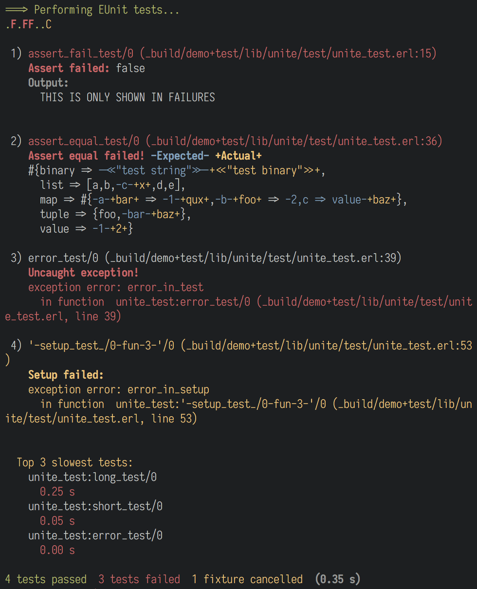

<h1 align="center">unite</h1>

<p align="center">
  <a href="https://hex.pm/packages/unite">
    
  </a>
  <a href="LICENSE">
    
  </a>
  
  <a href="https://github.com/sponsors/eproxus">
    
  </a>
</p>

<p align="center">
  Pretty EUnit test formatters
</p>
<p align="center">
  
</p>

## Installation & Usage

Add Unite as a dependency in your `rebar.config` and enable the Unite formatter:

```erlang
{profiles, [
    {test, [
        {deps, [unite]},
        {eunit_opts, [no_tty, {report, {unite_compact, []}}]}
    ]}
]}.

```

Using `no_tty` is important, because it disables the standard EUnit output.

Then just run Rebar 3 as usual: `rebar3 eunit`.

### Profiling

To get timings of long running tests, add `profile` to the option list:

```erlang
{eunit_opts, [no_tty, {report, {unite_compact, [profile]}}]}.
```

This will show the top 10 slowest tests (or the top N slowest tests if
`{profile, N}` is used).

## Donations

If you or your company use Unite and find it useful, [donations](https://github.com/sponsors/eproxus) are greatly appreciated!
